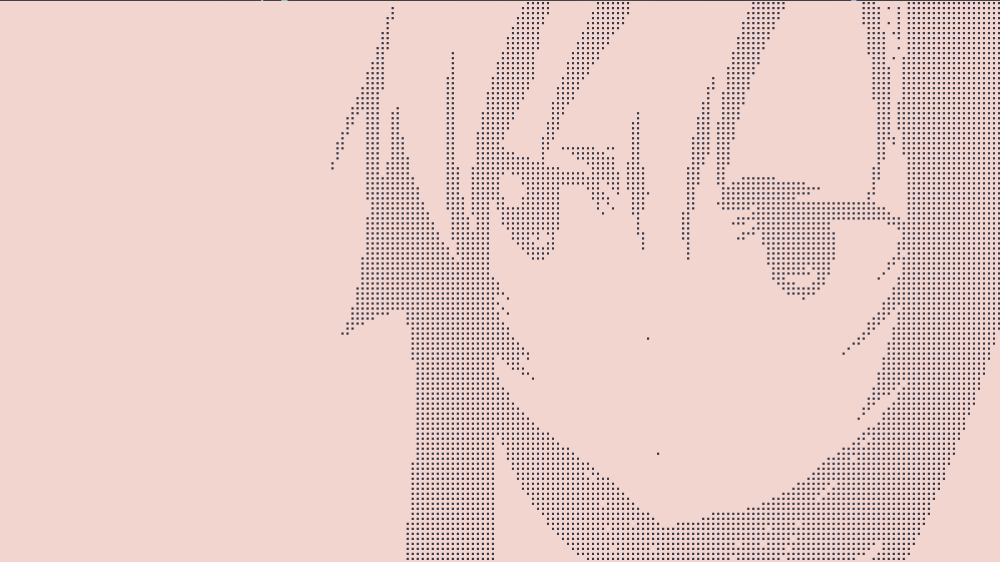

# Braille-Tool 🎨

一个用 **Go** 编写的轻量级命令行工具，可将图片转换为细腻的 **盲文点阵艺术 (Braille Art)**。

本项目特别适配 **Arch Linux** 环境下的 **Kitty** 终端。

## ✨ 功能特性
- **高质量缩放**：内置 Lanczos3 算法，精准保留图像线条细节。
- **自定义参数**：支持通过命令行调整输出宽度 (`-w`) 和亮度阈值 (`-t`)。
- **Arch 友好**：提供 `PKGBUILD` 脚本，支持原生软件包管理。

## 📸 效果演示




## 🚀 快速开始

1. **安装依赖**：
   
   ```bash
   go get [github.com/nfnt/resize](https://github.com/nfnt/resize)
   ```
2. **编译并运行**:
   ```bash
    go build -o braille-tool main.go
    ./braille-tool -i asuna.png -w 100 -t 40000
   ```
